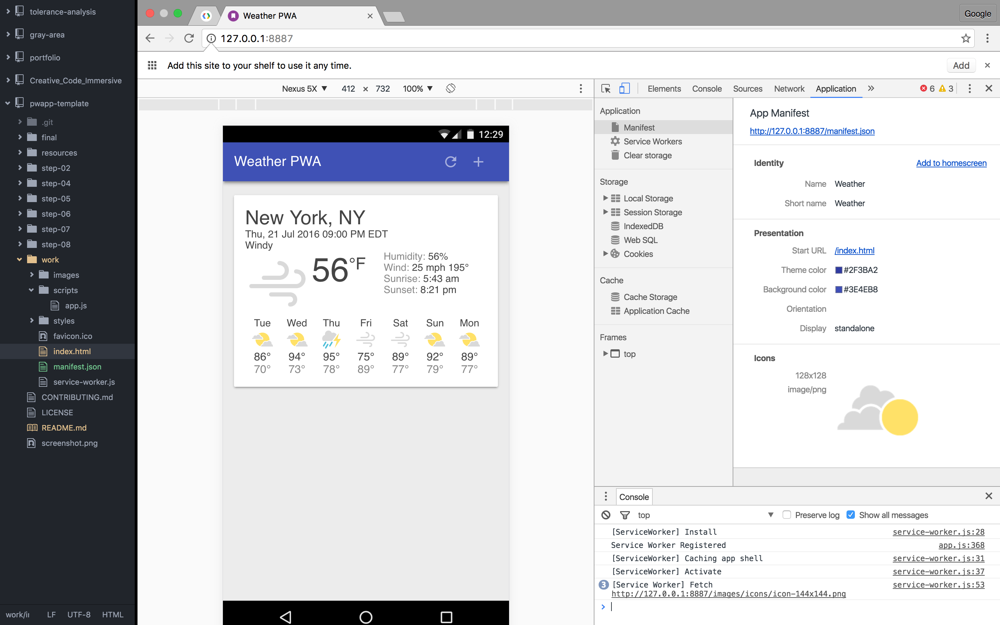

# Progressive Web App Template
*Notes from [Google Codelabs](https://codelabs.developers.google.com/codelabs/your-first-pwapp/index.html#7).*

[Progressive Web Apps](https://developers.google.com/web/progressive-web-apps) are experiences that combine the best of the web and the best of apps. They are useful to users from the very first visit in a browser tab, no install required. As the user progressively builds a relationship with the app over time, it becomes more and more powerful. It loads quickly, even on flaky networks, sends relevant push notifications, has an icon on the home screen, and loads as a top-level, full screen experience.

### Service Workers
Features provided via service workers should be considered a progressive enhancement, and added only if supported by the browser.

For example, with [service workers](https://developers.google.com/web/fundamentals/primers/service-worker/) you can cache the app shell and data for your app, so that it's available even when the network isn't. When service workers aren't supported, the offline code isn't called, and the user gets a basic experience. Using feature detection to provide progressive enhancement has little overhead and it won't break in older browsers that don't support that feature.

### App Manifest
The web app manifest, `manifest.json`, is a simple JSON file that gives developers the ability to control how your app appears to the user in the areas that they would expect to see apps (for example the mobile home screen), direct what the user can launch and more importantly how they can launch it.

Using the web app manifest, your web app can:

* Have a rich presence on the user's Android home screen
* Be launched in full-screen mode on Android with no URL bar
* Control the screen orientation for optimal viewing
* Define a "splash screen" launch experience and theme color for the site
* Track whether you're launched from the home screen or URL bar

The manifest supports an array of icons, intended for different screen sizes. At the time of this writing, Chrome and Opera Mobile, the only browsers that support web app manifests, won't use anything smaller than 192px.

* Place the manifest link on all your site's pages, so it will be retrieved by Chrome right when the user first visits, no matter what page they land on.
* The short_name is preferred on Chrome and will be used if present over the name field.
* Define icon sets for different density screens. Chrome will attempt to use the icon closest to 48dp, for example, 96px on a 2x device or 144px for a 3x device.
* Remember to include an icon with a size that is sensible for a splash screen and don't forget to set the background_color.

Further Reading:

[Using app install banners](https://developers.google.com/web/fundamentals/engage-and-retain/simplified-app-installs/)

### What is a Progressive Web App?
A Progressive Web App is:

**Progressive** - Works for every user, regardless of browser choice because it's built with progressive enhancement as a core tenet.

**Responsive** - Fits any form factor: desktop, mobile, tablet, or whatever is next.

**Connectivity independent** - Enhanced with service workers to work offline or on low-quality networks.

**App-like** - Feels like an app to the user with app-style interactions and navigation because it's built on the app shell model.

**Fresh** - Always up-to-date thanks to the service worker update process.

**Safe** - Served via HTTPS to prevent snooping and to ensure content hasn't been tampered with.

**Discoverable** - Is identifiable as an "application" thanks to W3C manifest and service worker registration scope, allowing search engines to find it.

**Re-engageable** - Makes re-engagement easy through features like push notifications.
Installable - Allows users to "keep" apps they find most useful on their home screen without the hassle of an app store.

**Linkable** - Easily share via URL, does not require complex installation
